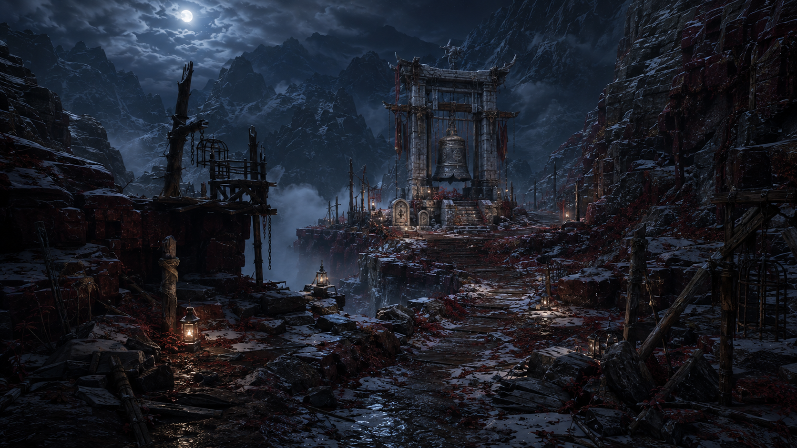
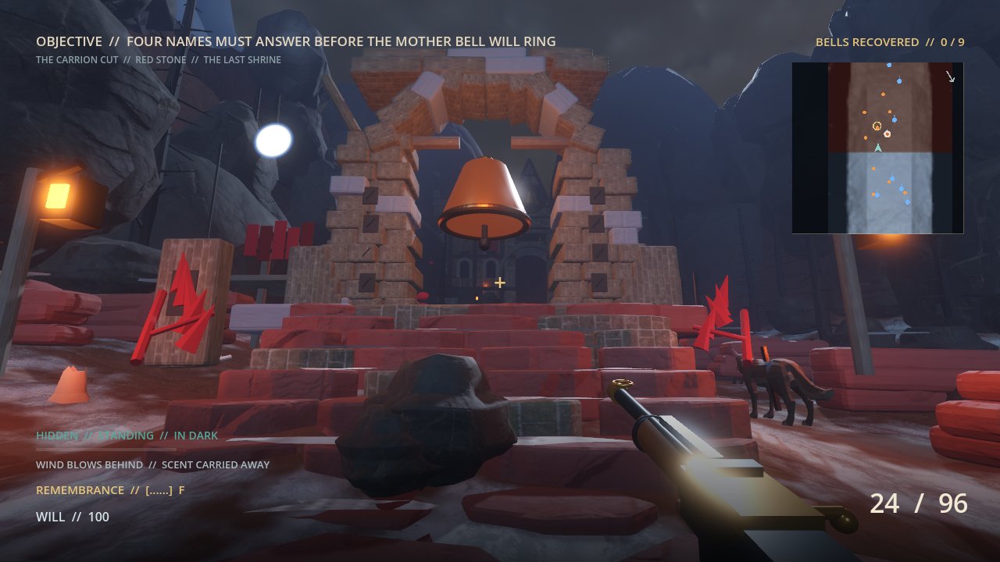
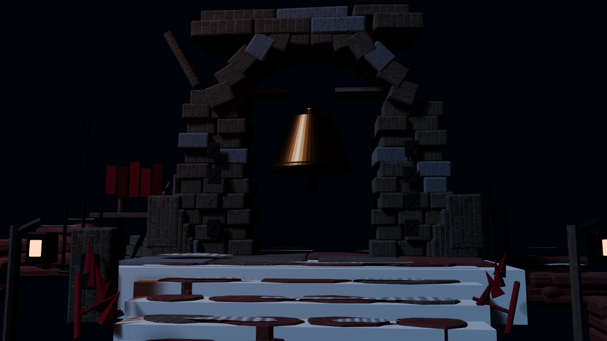
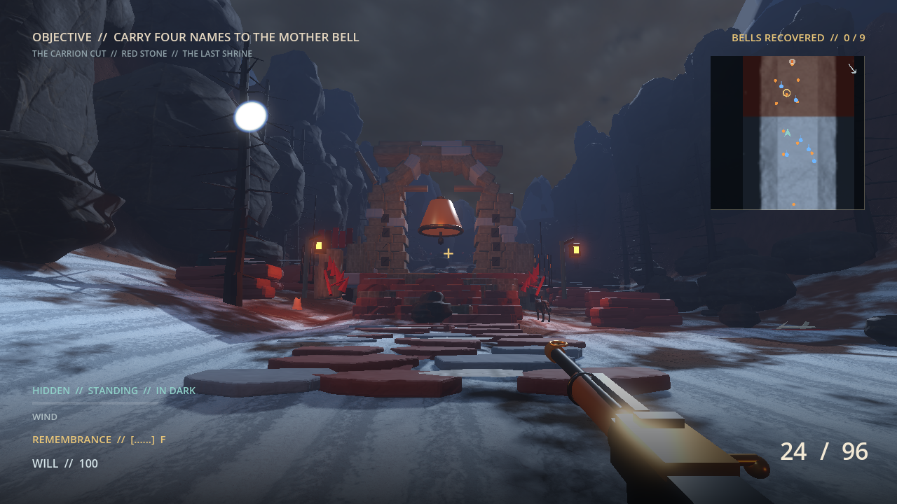

# Carrion Cut environment target

The Carrion Cut is the exposed middle scar of the mountain. It changes the
rhythm from Widowpine's enclosed stealth to longer ravine sightlines, then
forces the player up to the surviving mother bell.

## Locked identity

- Rust-red ironstone strata, dead pines, black ice, and a colder violet night
  replace Widowpine's living blue forest.
- The mother-bell shrine is an ancient processional frame built from irregular
  pale blocks. Varkas' hanging cages and watch ledges are visibly younger,
  rougher additions clamped to it.
- Broad snow-dusted steps keep the approach playable. Memorial stones and
  lanterns mark cover and flank choices around the central bell lane.
- Bellthorn has awakened around the old dead. Crimson growth stays near eight
  percent of the frame and guides the climb instead of carpeting it.
- Old kill-sites use sparse horn fragments, bones, and dry blood. The focus is
  desecration and consequence, not spectacle.
- No generic wooden bell frame, uniform orange fog, lush trees, castle walls,
  magic runes, aurora, or gore piles.

## Blender and Godot proof

This 2026-09-05 view is inside the shrine gameplay zone. Corrected terrain
winding reveals the red-earth and snow-pocket blend beneath the authored
steps. The shared material now changes coverage and roughness across the
biome instead of only tinting an otherwise identical snow surface.

The source `art_source/biomes/carrion_cut_mother_bell.blend` now reproduces the
terrain-fitted processional road, fractured shrine steps, segmented arch,
rain-dark name niches, occupation cages, memorial groups, restrained old
drainage stain, pointed bellthorn, and traversal collision. The live view
verifies that the road sits on Godot's authored height field, the original bell
interaction still points to the separate `MotherBell` mesh, and the center
remains open for combat. Its lower road now alternates irregular seven-to-nine
sided paving fragments and broken lane counts instead of repeating rectangular
slabs. The modular Blender source is retained while the
static Godot export is batched. The locked target remains the benchmark for
future micro-surface density, but the generic platform blockout has been
replaced.

## Final target-frame prompt

The built-in image-generation tool created the locked target with this prompt:

> Create the definitive Carrion Cut biome target for *Mountain Goat Killer:
> The Last Bell*, a desktop-first cinematic-realism first-person game. Compose
> a 16:9 player-height view with a 24 mm lens down a broad, playable alpine
> ravine. The center route climbs broken stone steps toward the surviving great
> mother bell, hung inside an ancient pale-stone processional frame on a raised
> shrine. Surround it with rust-red stratified cliffs, dead wind-torn pines,
> black ice, sparse snow, memorial stones, and long flanking sightlines. Show
> Varkas' occupation as crude timber watch ledges, iron cages, chains, and torn
> dark cloth visibly bolted onto the older sacred structure. Awakened crimson
> bellthorn roots and leaf drifts occupy roughly eight percent of the frame and
> lead the eye uphill. Include restrained old remains—small bones, horn
> fragments, and dry iron-dark stains—without fresh dismemberment or excessive
> gore. Use cold moonlight from above, violet ravine fog, sparse amber lamps,
> wet reflective rock, and physically plausible materials. No HUD, weapon,
> text, logo, watermark, people, monsters, aurora, magical glow, generic wooden
> bell frame, daylight, or castle gate. The result must feel exposed, brutal,
> ancient, and feasible as a modular Blender/Godot environment between the
> intimate Widowpine forest and the monumental Iron Crown.
