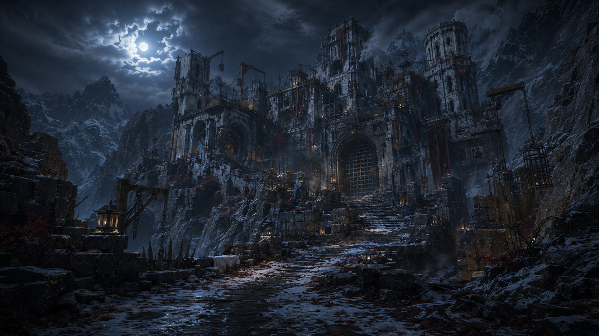
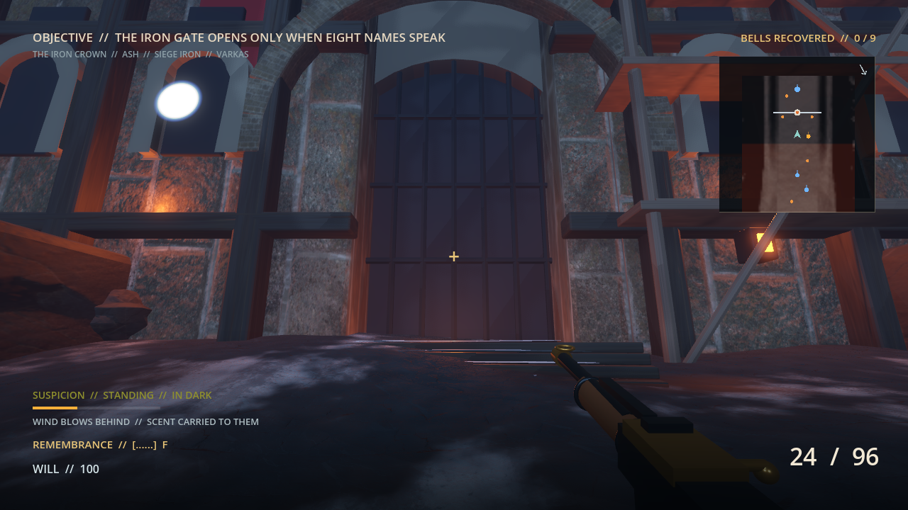
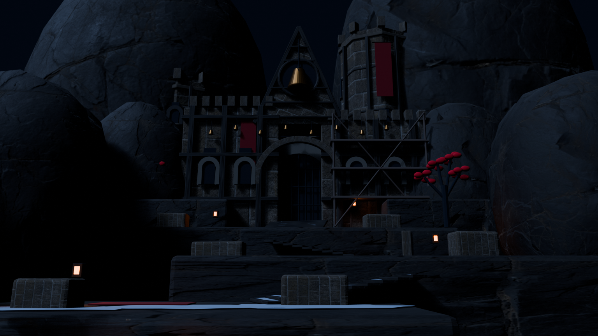
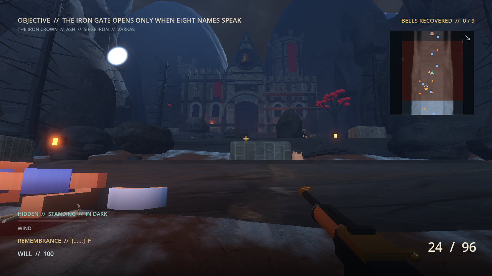
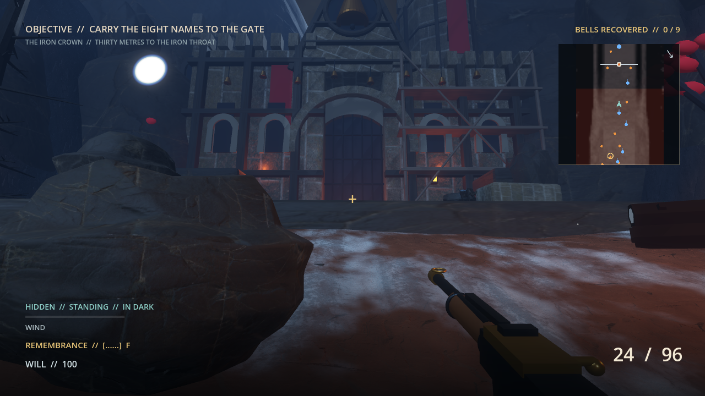
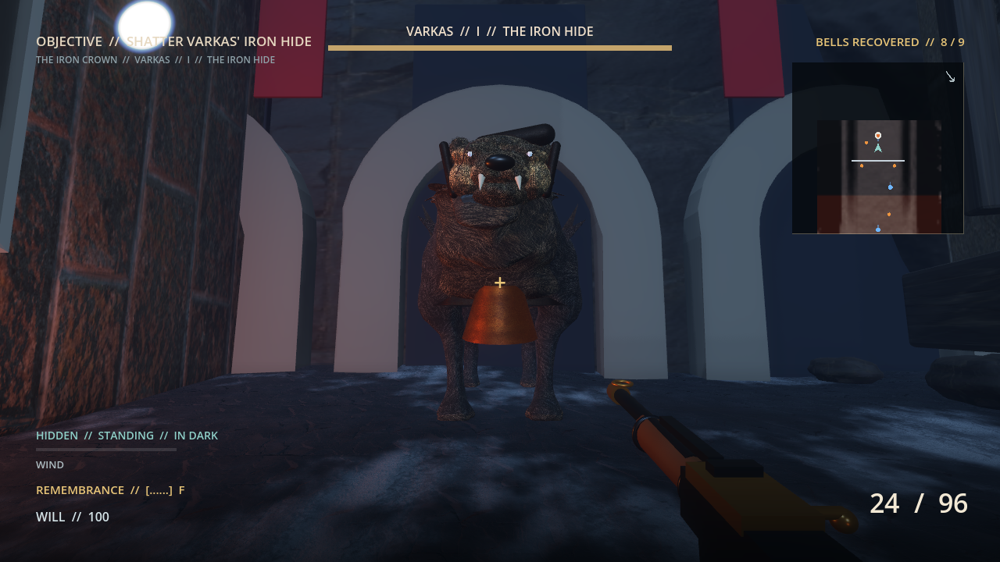
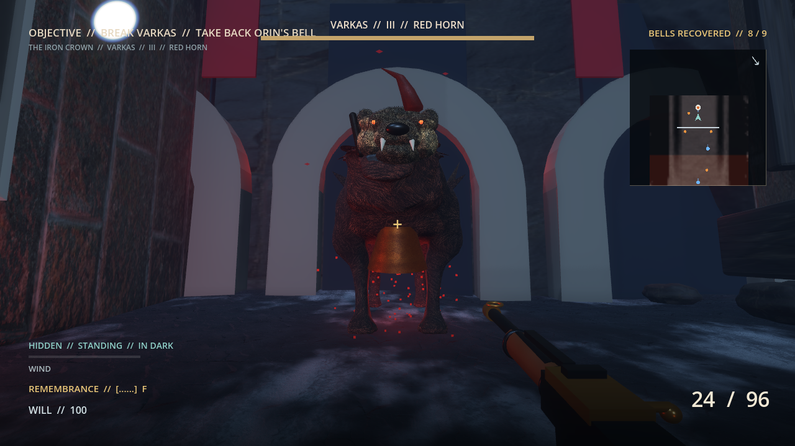
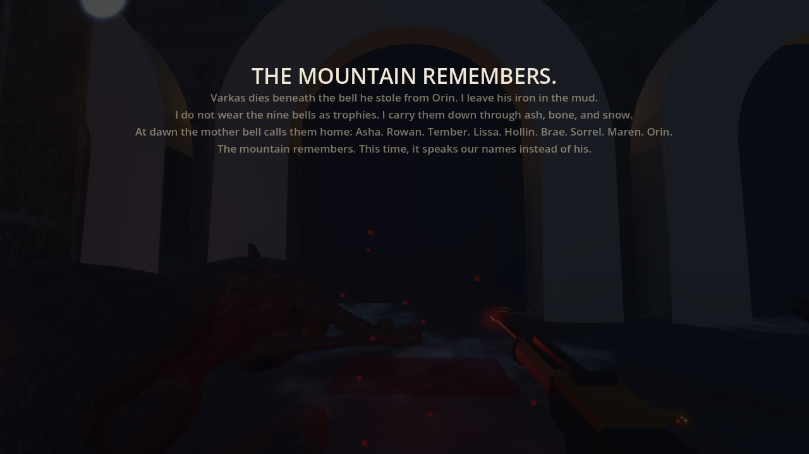

# Iron Crown bell-abbey slice

This is the locked production target for the first environment-rebuild slice.
It replaces the generic-fortress direction with a place that has two readable
eras: an ancient Ironhorn bell sanctuary and Varkas' recent brutal occupation.
The Blender build should preserve that contrast rather than reproduce every
offline-render detail.

The earlier [gatehouse exploration](iron-crown-gate-target-v1.png) remains in
the repository as a record of the rejected, overly generic direction. Its
useful contributions are limited to scale, night lighting, and the readable
approach.

## Locked identity

- The Iron Crown was a pale-stone mountain abbey raised around nine bells. It
  has an asymmetric octagonal tower, broken nave, memorial arches, ceremonial
  stairs, and foundations cut into the mountain.
- Varkas did not build the sanctuary. He seized it and added the Iron Throat
  portcullis, black-iron cages and chains, rough firing platforms, barricades,
  soot, torn banners, and crude siege repairs.
- Crimson bellthorn is the signature life-form. It appears as roots, sparse
  trees, and leaf drifts rather than a uniform red carpet.
- The approach is a playable S-shaped ascent across three broad combat
  terraces. Stairs are broken into short runs; cover and alternate sightlines
  matter more than architectural spectacle.
- Cold moonlight establishes the massing. Restrained amber lamps mark the only
  safe route through dirty snow, wet limestone, black ice, and storm fog.
- The silhouette must remain asymmetric. No centered twin-tower gatehouse,
  ornate fantasy spires, aurora, magical glowing stone, or indiscriminate gore.

## Biome progression

1. **Widowpine:** blue-black forest and old snow. Bellthorn is dormant and is
   seen only as dark red roots at graves and wounded trees.
2. **Carrion Cut:** the crimson growth wakes around the shrine and old dead.
   Ringing the mother bell releases the first visible leaf storm.
3. **Iron Crown:** the bellthorn has overrun the desecrated sanctuary. Its red
   movement becomes both a navigation language and part of Varkas' climax.

## First-slice Blender deliverables

1. Sanctuary silhouette: octagonal Ninefold tower, lower broken nave, memorial
   arcade, gate tunnel, courtyard threshold, and mountain-cut foundations.
2. Occupation layer: recessed Iron Throat portcullis, scaffold silhouettes,
   timber cranes, cages, chains, barricades, and damaged banners.
3. Traversal blockout: lower reveal, three wide switchback terraces, short stair
   runs, cover plinths, ruined masonry, and a clear entrance lane.
4. Import geometry: modular render parts in the editable `.blend`, a batched
   static visual export, separate simple collision meshes, grounded pivots,
   applied transforms, and metric scale. Gate bars and review landmarks remain
   individually named for gameplay and validation.

## Review cameras

- **Reveal:** player-height camera at the lower ravine. The sanctuary dominates
  the upper middle while the path and each terrace remain legible.
- **Approach:** thirty metres from the Iron Throat. The occupation layer is
  obvious without hiding the abbey's older graceful structure.
- **Threshold:** inside the gate tunnel looking toward Varkas' courtyard. The
  arena entrance feels dangerous but preserves clean combat sightlines.

The slice does not expand into Widowpine or the Carrion Cut until all three
cameras work in the live game and existing combat, bell, gate, and Varkas state
transitions still pass.

## Current implementation proof

The 2026-09-05 surface review uses normal gate-zone selection. Reversed terrain
winding has been corrected; visible ash-dark ground and irregular residual
snow now meet the abbey stairs. Earlier long-distance review cameras remain
useful for architecture. Landmarks now remain visible across biome boundaries;
the newer `art_direction/traversal/` captures verify the normal approach and
boundary crossings without making architecture appear at a zone threshold.

The first image is the reproducible Blender reveal render. The other three are
actual 1280 by 720 frames captured from the game's player camera after the GLB
was imported, positioned, lit, and given traversal collision in Godot. The
phase-three frame verifies the clear arena lane, Varkas, the red bellthorn
storm, and the recovered-name lights together. The latest Blender pass adds a
weathered central gable, a large scarred founding bell, eight hanging name
bells, masonry ribs, irregular wind-scoured stair snow, and moves the Ninefold
tower outward so it no longer crushes the final charge lane. These remain
production proofs rather than the offline target's final material density. A
lifted pale-limestone pass and Iron-Crown-only moon bounce now preserve the old
arches against the black occupation scaffold from both approach cameras. The
export batches the static abbey while keeping the Iron Throat pieces separate,
and Godot renders the abbey only inside the Iron Crown biome.

## Final target-frame prompt

The built-in image-generation tool used the supplied ruined crimson abbey as
the primary identity reference and the first gate image only as a supporting
composition and lighting reference. The final prompt was:

> Create the definitive Iron Crown v2 reveal for *Mountain Goat Killer: The
> Last Bell*. This fortress was once the Ironhorn herd's ancient bell sanctuary
> and has been seized and mutilated by Varkas. Preserve graceful pale
> bell-abbey masonry: an octagonal Ninefold bell tower, a broken nave, tall
> weathered arches, memorial niches, old ceremonial stairs, and parts carved
> directly into the mountain. Overlay crude black-iron occupation architecture:
> a deeply recessed portcullis called the Iron Throat, cages, chains,
> barricades, timber firing platforms, soot, siege repairs, torn dark-red
> banners, and brutal functional additions visibly younger than the abbey.
> Crimson bellthorn trees, leaf drifts, and root systems invade cracks in the
> stone but remain controlled to roughly fifteen percent of the frame.
> Compose a cinematic 16:9 view from a human first-person eye height with a
> 24 mm lens. A clear S-shaped switchback ceremonial ascent crosses three wide,
> playable combat terraces with cover, ruined masonry, and alternate sightlines,
> then enters a recessed gate tunnel into a courtyard. Use a strongly
> asymmetric silhouette framed by steep cliffs. Light it at blue-hour night in
> a storm: cold moonlight from the upper left, sparse warm navigation lamps,
> physically plausible volumetric fog, dirty snow, spindrift, chimney smoke,
> loose crimson leaves, wet reflective stone, and black ice. Materials are pale
> weathered limestone, black granite, dirty snow, rusted iron, rough timber,
> soot, and faded cloth. Integrate nine subtle bell motifs. No HUD, weapon,
> text, logo, watermark, humans, winged figures, monsters, aurora, magical glow,
> ornate fantasy spires, bright daylight, centered generic gatehouse,
> impossible architecture, or excessive gore. The result must be grounded,
> tragic, original, and buildable as a modular Blender/Godot environment.
