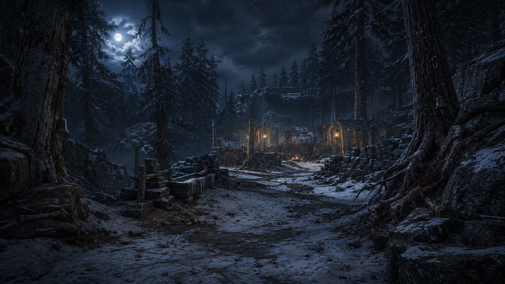
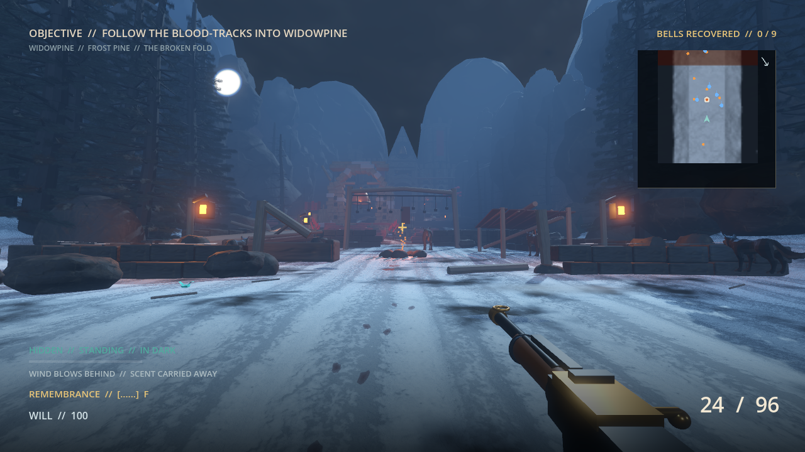
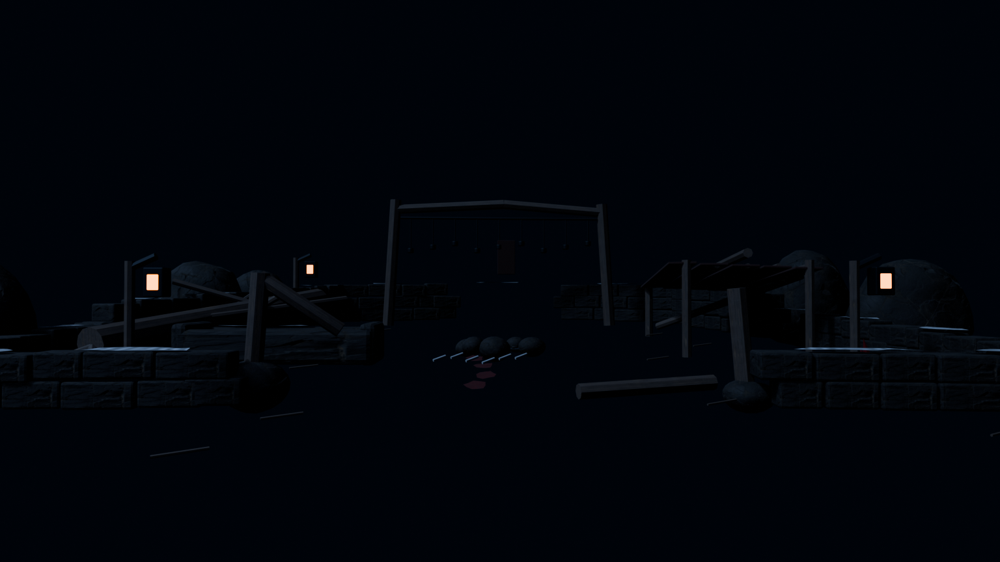
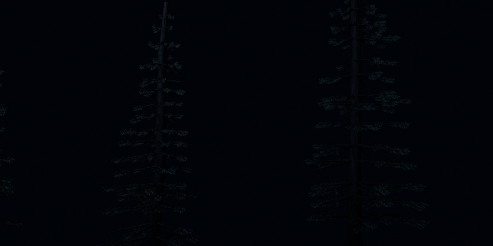
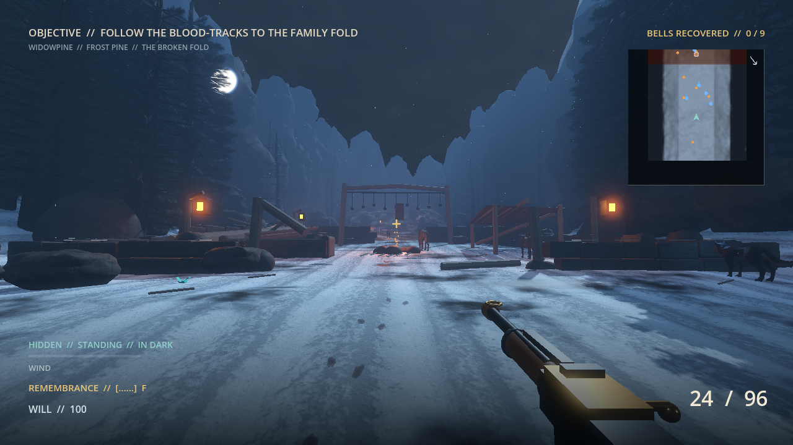

# Widowpine environment target

Widowpine is the quiet wound at the beginning of *The Last Bell*. It is not a
generic fantasy forest and it is not Varkas' main camp. The place was the
Ironhorn family's winter fold before the raid; his warpack now sleeps inside
what it broke.

## Locked identity

- Tall, blue-black frost pines close the sightlines and keep the space intimate.
- The hero landmark is an ancestral dry-stone fold with an ice trough, empty
  named-bell rack, broken entry frame, cold fire ring, and a single crude hide
  shelter added by the occupiers.
- Old drag marks, a few weathered bones, and iron-dark blood carry the violence.
  Gore is evidence, not decoration.
- Bellthorn is dormant here: isolated dark-red roots and leaves stay below
  three percent of the frame.
- Moonlight and snow are cold blue. Three warm lanterns define the infiltration
  route without turning the fold into a brightly lit camp.
- No bright tents, lush green park trees, aurora, magic light, clean masonry,
  or symmetrical village composition.

## Blender and Godot proof

The 2026-09-05 terrain audit corrected reversed face winding that had hidden
the height field despite valid collision. This newer view shows the actual
packed-snow surface, scan normals, irregular exposed ground, and readable HUD
from inside the normal Widowpine gameplay zone.

The editable sources are `art_source/biomes/widowpine_broken_fold.blend` and
`art_source/vegetation/widowpine_tree_kit.blend`. The live frame verifies the
terrain-fitted curved wall runs, nine-chain memorial rack, shattered entry,
collapsed smoke-black shelter, foreground roots, exact traversal collision,
PBR snow and fieldstone, custom transparent pine cards, lantern volumes,
root-flared trunks, shallow wind-cut snow crust, enemies, HUD, and broad
playable lane together. The target image remains the
micro-surface and naturalism benchmark; the implemented fold is the production
layout rather than a generic blockout. Its editable parts stay modular in
Blender, while the Godot export is statically batched and remains visible
along the continuous ravine. The final pine kit uses irregular windward gaps,
tapered crowns and forked needle sprays, with the existing scanned bark and
original snowy branch texture.

## Final target-frame prompt

The built-in image-generation tool created the locked target with this prompt:

> Create the definitive Widowpine biome target for *Mountain Goat Killer: The
> Last Bell*, a desktop-first cinematic-realism first-person stealth game. Show
> a 16:9 player-height view through a moonlit alpine pine forest using a 24 mm
> lens. The forest is dense, blue-black, wind-bent, and heavy with patchy old
> snow. A clear, broad infiltration path leads to the Ironhorn family's broken
> ancestral fold: low dry-stone walls, an ice trough, a shattered timber gate,
> empty bell chains, one crude hide shelter left by Varkas' raiders, and three
> sparse warm lanterns. The composition must preserve readable stealth lanes,
> waist-high cover, and flanking routes. Add restrained ten-year-old evidence
> of the massacre—an iron-dark drag mark, a few small bones, and dried blood in
> snow—never fresh splatter. Dormant bellthorn appears only as rare dark-crimson
> roots and leaves, under three percent of the image. Use physically plausible
> moonlight, ground fog, snow flurries, wet stone, rough timber, real pine bark,
> and subtle warm-cold contrast. No HUD, weapon, text, logo, watermark, people,
> monsters, aurora, magical glow, bright tents, fantasy village, daylight, or
> excessive gore. The result must feel intimate, tragic, buildable in Blender
> and Godot, and visually distinct from the red Carrion Cut and monumental Iron
> Crown.
